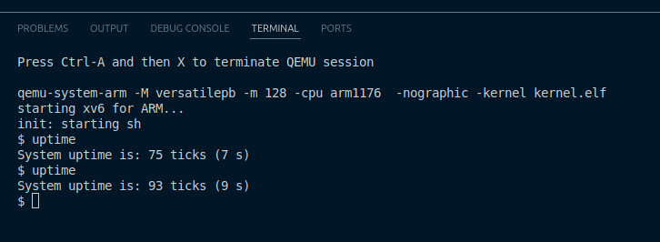
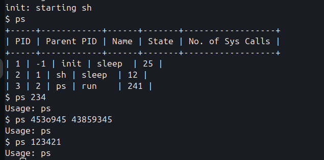

# Assignment 1

Authors:
- Aarsh Wankar
- Abhinav Khot
- Jaskirat Singh Maskeen
- Karan Sagar Gandhi

## Uptime
To implement the `uptime` command, we used the syscall for uptime. It returns the time in ticks [ref](https://github.com/IITGN-Operating-Systems/programming-assignment-1-child-killers/blob/main/sysproc.c), which reads the `tickslock`. This is initialized in `timer_init` [ref](https://github.com/IITGN-Operating-Systems/programming-assignment-1-child-killers/blob/main/device/timer.c), where a frequency is required. The frequency is defined in [ref](https://github.com/IITGN-Operating-Systems/programming-assignment-1-child-killers/blob/main/param.h) as `HZ`.  

We can return the uptime in seconds by doing:  

$$
\text{uptime (s)} = \frac{\text{ticks}}{\text{HZ}}
$$  


Since the frequency is in kernel space, we exposed it to user space by creating a new syscall:  
- Defined `sys_clockfreq` in [ref](https://github.com/IITGN-Operating-Systems/programming-assignment-1-child-killers/blob/main/sysproc.c).  
- Added a call number in [ref](https://github.com/IITGN-Operating-Systems/programming-assignment-1-child-killers/blob/main/syscall.h).  
- Registered it in [ref](https://github.com/IITGN-Operating-Systems/programming-assignment-1-child-killers/blob/main/syscall.c).  
- Updated [ref](https://github.com/IITGN-Operating-Systems/programming-assignment-1-child-killers/blob/main/usr/usys.S).  
- Added the user function `clockfreq` in [ref](https://github.com/IITGN-Operating-Systems/programming-assignment-1-child-killers/blob/main/usr/user.h).  

We also added the new `uptime.c` file [ref](https://github.com/IITGN-Operating-Systems/programming-assignment-1-child-killers/blob/main/usr/uptime.c) to `UPROGS` in [ref](https://github.com/IITGN-Operating-Systems/programming-assignment-1-child-killers/blob/main/usr/Makefile).  

Now we can use the function `clockfreq()` to get the clock frequency in HZ and display uptime in seconds.  

Below is the output of the command:  



## Pause
We added a new `pause.c` file [ref](https://github.com/IITGN-Operating-Systems/programming-assignment-1-child-killers/blob/main/usr/pause.c) and wrote the functionality for the pause command. We also updated [ref](https://github.com/IITGN-Operating-Systems/programming-assignment-1-child-killers/blob/main/usr/Makefile) to include it in `UPROGS`.

In our implementation, we first read the command-line argument and convert it to an integer using `atoi`.  
- If no argument is given, or if the number is negative, we print an error message to `stderr`.  
- Otherwise, we calculate the number of ticks using the `clockfreq()` syscall (the same one used in the `uptime` command).  

Finally, we call the `sleep(num_ticks)` syscall. Once the sleep is over, the program exits with `exit(0)`.

<video width="640" controls>
  <source src="./media/pause_1.mp4" type="video/mp4">
</video>


## Tab Autocompletion
To implement the autocomplete command we faced a lot of difficulties

We first tried autocomplete by making a new function ```complete```, which ran in ```console.c```. It detected the character being typed and in case of a tab, we filled the console buffer with the possible completion. However, this had two issues, one being the fact that we had to hardcode each command into an array of strings, and the other being that it worked only when there was just one possible completion. Additionally, we also thought that autocomplete should run in the user space and not the kernel space, as we wanted the constintr to be as simple and minimal as possible. The initial implementation can be found here:
[Initial Implementation](https://github.com/IITGN-Operating-Systems/programming-assignment-1-child-killers/commit/ce678bbb7e4d99a20360e9143131a581b700b5e9).

Next, we considered moving autocomplete to the user space by treating the tab character similar to how we treated the enter key. This however, meant that pressing tab would "commit" our current input and the backspace key would not work. 

Then we were able to make it work using the following way:
The commands are commands which are defined in the Makefile inside usr [ref](https://github.com/IITGN-Operating-Systems/programming-assignment-1-child-killers/blob/main/usr/Makefile)
So, inside usr directory, we will have `_.*` as the command name. We will consider only those as commands for autocomplete.

So, we edit the main Makefile [ref](https://github.com/IITGN-Operating-Systems/programming-assignment-1-child-killers/blob/main/Makefile), to automatically generate a C source file, at `build/autocmds.c` everytime we comiple the OS.
We basically read the Makefile in usr dir, and extract out the list of commands starting with `_`.

This is how the resultant file looks like:

```c
const char *commands[] = {
    "cat",
    "echo",
    // ... other commands
    0 // to indicate end of array
};
```

It ends with 0, so that `console.c` [ref](https://github.com/IITGN-Operating-Systems/programming-assignment-1-child-killers/blob/main/console.c) knows when the commands array ends. In commands.c there is `extern const char *commands[];` which will tell the linker to find the array.

So the autocomplete logic was in the console.c file, [ref](https://github.com/IITGN-Operating-Systems/programming-assignment-1-child-killers/blob/main/console.c), there, `\t` triggers the console interrupt handler, then finds the word typed from the buffer, compares with the commands array, and if its unique, autocompletes otherwise it prints the list of commands and in the new line writes till what user had currently written.

But then we thought that `console.c` should be kept dumb and tab completion should ideally be handled by the `sh.c` (the shell). Hence we moved the autocompelte fucniton yet again to the user space [ref](https://github.com/IITGN-Operating-Systems/programming-assignment-1-child-killers/blob/main/usr/sh.c), but also ratehr than detecting tab in `console.c`, we wake up on all key presses, and let `sh.c` handle what to do with the input characters. In this way we are able to implement the tab completion.

PS: backspaces work!!!

<video width="640" controls>
  <source src="./media/autocomplete_1.mp4" type="video/mp4">
</video>


## PS

We implement the ps command to work entirely in the user space. To aid this we implement the following syscalls:
- int get_nsyscall(int pid) : Returns the number of syscalls made by the process.
- int get_proclist(int* buffer): The kernel writes to the buffer in the user space passed as an arg with the active processes. Writes -1 in the spot of an unused process.
- int get_parproc(int pid): Returns the PID of the parent process.
- int get_procstate(int pid): Returns the current state of the processs.(eg. running, sleep, zombie etc)
- int get_procname(int pid, char* buffer): Writes the name of the process with the given ID in the buffer in user space passed as an arg.

The command itself is implemented in `usr/ps.c`

The working is shown below:



PS: the absurd number of syscalls made by ps is due to how printf() is implemented in the OS. Each charecter printed takes one sys call :0. Also the root process init has been given an arbitrary parent (-1).
