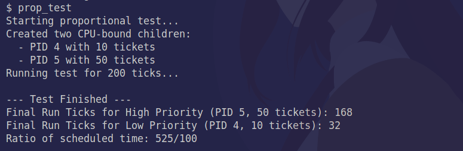

# Assignment 2

Authors:
- Aarsh Wankar
- Abhinav Khot
- Jaskirat Singh Maskeen
- Karan Sagar Gandhi


## 1.1 Basic lottery scheduler

First we need to make sure that the scheduler is called for every tick. This is done in `trap.c` wherein every tick we call `yield`. We also kill any processes that have been marked for killing.

```c
void irq_handler (struct trapframe *r)
{
    // proc points to the current process. If the kernel is
    // running scheduler, proc is NULL.
    if (proc != NULL) {
        proc->tf = r;
    }

    pic_dispatch (r);
    if (proc!= NULL){
        yield();
        if (proc->killed) exit(0);
    }

}
```

We implement the basic lottery scheduler mostly in `proc.c` itself. The main ccode to do this is as follows:

```c
int get_total_tickets() // returns the total number of tickets to be used during the lottery including artificially boosted tickets
{
    int total = 0;
    for (struct proc* p = ptable.proc; p < &ptable.proc[NPROC]; p++)
    {
        if (p->state != RUNNABLE) continue;
        total += ((p->boosts ? 2 : 1) * p->tickets);
    }
    return total;
}

// returns a pointer to the lottery winner.
struct proc *hold_lottery(int total_tickets) {
    // total_tickets here includes the tickets obtained from artificial boosting during the lottery.
    if (total_tickets <= 0) {
        cprintf("this function should only be called when at least 1 process is RUNNABLE");
        return 0;
    }

    uint random_number = rand();    // This number is between 0->4 billion
    uint left = random_number % total_tickets + 1; // we pick the process that makes this number <= 0 when iterating through all the processes.

    struct proc* winner;

    for (struct proc* p = ptable.proc; p < &ptable.proc[NPROC]; p++)
    {
        if (p->state != RUNNABLE) continue;
        if (p->boosts){
            p->boosts--;
            if (2 * p->tickets >= left)
            {
                winner = p; break;
            }
            left -= 2 * p->tickets;
        }
        else{
            if (p->tickets >= left)
            {
                winner = p; break;
            }
            left -= p->tickets;
        }
    }
    return winner;
}

//PAGEBREAK: 42
// Per-CPU process scheduler.
// Each CPU calls scheduler() after setting itself up.
// Scheduler never returns.  It loops, doing:
//  - choose a process to run
//  - swtch to start running that process
//  - eventually that process transfers control
//      via swtch back to the scheduler.
void scheduler(void)
{
    struct proc *p;

    for(;;){
        // Enable interrupts on this processor.
        sti();

        // Loop over process table looking for process to run.
        acquire(&ptable.lock);
        // lottery sched
        int total_tickets_during_lottery = get_total_tickets();
        if (total_tickets_during_lottery == 0) goto next;

        p = hold_lottery(total_tickets_during_lottery);
        proc = p;
        switchuvm(p);
        p->state = RUNNING;
        p->runticks += 1; // this process has been scheduled for one more tick

        swtch(&cpu->scheduler, proc->context);
        // Process is done running for now.
        // It should have changed its p->state before coming back
        proc = 0;
        next:
        release(&ptable.lock);
    }
}
```

We implement two functions, one to get the total number of tickets and another one to actually hold the lottery. We also ensure to boost the number of tickets artificially if there is a need. 

The proc struct is also modified to include the number of tickets and the remaining number of boosts that the process has currently.

## 1.2 Compensating processes for blocking

To incentivize processes to go to sleep we increase the number of boosts a process has with the number of ticks that it was sleeping for. The code for this can be found in `syscproc.c` in the `sys_sleep` function.

```c
int sys_sleep(void)
{
    int n;
    uint ticks0;

    if(argint(0, &n) < 0) {
        return -1;
    }

    acquire(&tickslock);

    ticks0 = ticks;
    proc->wakeup_tick = ticks0 + n;
    // for debugging / visualizing
    // while(ticks - ticks0 < n){
    while(ticks < proc->wakeup_tick){
        if(proc->killed){
            release(&tickslock);
            return -1;
        }
        // cprintf("%s (%d) sleepcall\n",proc->name, proc->pid);
        sleep(&ticks, &tickslock);
    }
    proc->wakeup_tick = 0;
    release(&tickslock);
    proc->boosts += n; // give boosts for sleep time
    return 0;
}
```


## 1.3 Improving the Sleep/Wake Mechanism

First job was to decipher how the sleep and wakeup work.
Here is our understanding of the same:

### Original `sleep`
1. when `sleep(n)` is called from usersapce, then that essentially passes to `sys_sleep()` in kernel space [ref](./../sysproc.c). It retrieves the number of ticks `n` the process has to sleep for. Then initial ticks, `ticks0` are saved, after locking the global `ticks`. 
2. The `while` loop in `sys_sleep()` runs, till `ticks` - `ticks0` < n (the elapsed ticks is less than n), and if the process is not yet killed, it calls `sleep(&ticks, &tickslock)` defined in [ref](./../proc.c). Here `&ticks` is the wait channel. locks are required to prevent race conditions.
3. The `sleep(&ticks, &tickslock)` changes the state from `RUNNING` to `SLEEPING`, and sets the `proc->chan = &ticks`. Then `sched()` is called to schedule the next process. Hence in this way we put the current process to sleep!

### Original `wakeup`
1. `wakeup` runs periodically (called from `isr_timer` in [ref](./../device/timer.c)) as `wakeup(&ticks);`, which after locking the `ptable`, it calls `wakeup1(&ticks)`.
2. `wakeup1(&ticks)` iterates through the process table, and checks if the process is in `SLEEPING` state and `proc->chan == &ticks`, then it sets the state to `RUNNING`.

### The issue:
So essentially, every `ticks` increment is a wakeup call. when the process, which is currently sleeping (and has more ticks remaning to sleep), wakes up, it goes back to  the `while` loop to check `ticks - ticks0 < n`, and again goes to sleep.

This behavior is indicated with trivial logging, in the following video:

<video width="640" controls>
  <source src="./media/original_sleep.mp4" type="video/mp4">
</video>

### Improved Process:
We add a new field to the `proc` struct, that is, `uint wakeup_tick;`. This will store the tick at which the intended process has to wake up.
We initialise this to `0` when we run `allocproc` or `wait` in [ref](./../proc.c).

`sys_sleep()` is modified in the following way:
```diff
 int sys_sleep(void)
 {
     int n;
     uint ticks0;
     if(argint(0, &n) < 0) {
         return -1;
     }
     acquire(&tickslock);
     ticks0 = ticks;
     
+    proc->wakeup_tick = ticks0 + n;

-    while(ticks - ticks0 < n){
+    while(ticks < proc->wakeup_tick){
         if(proc->killed){
             release(&tickslock);
             return -1;
         }
+     // cprintf("%s (%d) sleepcall\n",proc->name, proc->pid);
         sleep(&ticks, &tickslock);
     }
+    proc->wakeup_tick = 0;
     release(&tickslock);
     return 0;
 }
```

This doesn't really help much if we do not fix the wakeup1 implementation as well. The idea is to for wakeup1 to see if `ticks <= proc->wakeup_tick`, then only set the state to `RUNNING`.

Here is the modified `wakeup1()`


```diff
static void wakeup1(void *chan)
 {
     struct proc *p;

     for(p = ptable.proc; p < &ptable.proc[NPROC]; p++) {
         if(p->state == SLEEPING && p->chan == chan) {
-            p->state = RUNNABLE;
+            if (p->wakeup_tick == 0 || ticks >= p->wakeup_tick){
+                   if (chan == &ticks){
+                    cprintf("%s (%d) wakeup\n",p->name, p->pid);
+                }
+                p->state = RUNNABLE;
+               }
         }
     }
 }
```

With these temporary logging messages, we can see the running of this improved sleep mechanism in the following video:

<video width="640" controls>
  <source src="./media/improved_sleep.mp4" type="video/mp4">
</video>

## Tests

First we need to test whether the proportion of time the proceses are scheduled for is equal to the ratio of the number of tickets assigned to them. We include this test as a user command `prop_test`.

The result of running this command is shown below.



The expected ratio is 5 and the ratio we get emperically is 5.25 which is good enough.