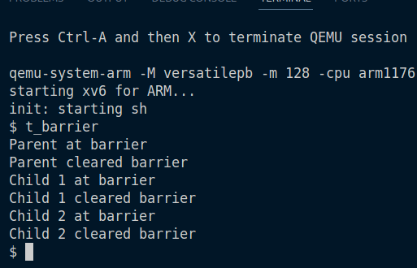
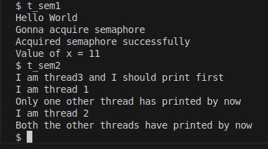

## Task 1: Barriers as synchronization primitives (4 pts.)

Our goal is to keep processes waiting till `N` processes arrive at some barrier, and then all should be woken up.

For this we keep a counter, `barrier_counter`. Now when a new process arrives, if the counter is less than `N`, then this process should sleep (on channel,`barrier_counter`). When the `N`-th process arrives, we wake up all the processes sleeping on the channel `barrier_counter`.

Since multiple processes can arrive at the same time, to prevent race conditions we use a `spinlock` on the counter.

### Without barrier `t_barrier`

### With barrier `t_barrier`

## Task 2: Threads (8 pts.)
To provide concurrency within a single process, three new system calls have been implemented:

* `thread_create(uint* thread, void* (*start_routine)(void*), void* arg)`

* `thread_exit()`

* `thread_join(uint thread)`

These system calls allow for the creation, termination, and reaping of threads within a process. Threads share the same memory space but have their own stacks.
### System Call Implementation
#### `thread_create`

The `thread_create` system call is analogous to fork but creates a new thread of execution within the context of the calling process.

##### Arguments:

        uint* thread: A pointer to a uint where the thread ID (TID) of the newly created thread will be stored.

        void* (*start_routine)(void*): A pointer to the function that the new thread will execute.

        void* arg: An argument to be passed to the start_routine function.

##### Implementation Details:

* A new proc structure is allocated for the thread.

* The new thread shares the page directory of the parent process, so no new page table is created.

* A new user stack is allocated for the thread. The process size is increased to accommodate the new stack.

* The new thread's trap frame is configured so that execution begins at the start_routine function. The argument is placed on the user stack.

* The is_main_thread flag in the proc structure is set to 0 to distinguish it from a process created with fork.

* The new thread is marked as RUNNABLE.

#### `thread_exit`

The thread_exit system call terminates the calling thread.

##### Implementation Details:

* The thread's state is set to ZOMBIE.

* The parent process is woken up if it is waiting in thread_join.

* The scheduler is called to switch to another process/thread.

* If called by a main thread, it acts as a no-op.

#### `thread_join`

The thread_join system call waits for a specific thread to terminate.

##### Implementation Details:

* The calling process sleeps until the target thread's state becomes `ZOMBIE`.

* The resources of the terminated thread, such as its kernel stack and user stack, are freed.

* `thread_join` can only be used to reap spawned threads, not child processes created with fork.

### Data Structures

The proc structure has been modified to support threads:

    is_main_thread: A flag to differentiate between main threads (processes) and spawned threads.

    thread_id: The thread ID, which is the same as the pid.

### Tests

## Task 3. Userspace locks and condition variables (6 pts.)
This section details the implementation of userspace synchronization primitives: spinlocks and condition variables.

### Spinlocks
Spinlocks are implemented entirely in userspace using atomic instructions, providing a basic mechanism for mutual exclusion.

* `void initiateLock(struct lock* l)`: This function initializes the lock by setting its lockvar to 0, indicating that the lock is available.

* `void acquireLock(struct lock* l)`: A thread calls this function to acquire the lock. It repeatedly attempts to set lockvar to 1 using the atomic xchg (exchange) instruction. The thread "spins" in a loop until it successfully acquires the lock (i.e., when xchg returns 0).

* `void releaseLock(struct lock* l)`: This function releases the lock by setting lockvar back to 0, allowing other threads to acquire it.

### Condition Variables
Condition variables provide a more advanced synchronization mechanism, allowing threads to wait for specific conditions to become true without busy-waiting. This implementation required adding several new system calls.

#### New System Calls
* `int getChannel(void)`: Returns a unique, unused channel identifier. This is crucial to prevent spurious wakeups where a thread is awakened by a signal meant for another purpose.

* `void sleepChan(int chan)`: Puts the calling process to sleep on the specified channel.

* `void sigChan(int chan)`: Wakes up all processes sleeping on the specified channel.

* `void sigOneChan(int chan)`: Wakes up one process sleeping on the specified channel.

#### Userspace API
* `void initiateCondVar(struct condvar* cv)`: Initializes the condition variable by obtaining a unique channel from the kernel using the getChannel syscall.

* `void condWait(struct condvar* cv, struct lock* l)`: This function is the core of the condition variable logic. It atomically releases the lock, puts the thread to sleep on the condition variable's channel, and then re-acquires the lock upon waking up. This prevents lost wakeups and ensures atomicity.

* `void broadcast(struct condvar* cv)`: Wakes up all threads waiting on the condition variable by calling the sigChan syscall.

* `void signal(struct condvar* cv)`: Wakes up a single thread waiting on the condition variable by calling the sigOneChan syscall.

#### Tests

## Task 4. Semaphores in xv6 (4 pts.)
Semaphores are a versatile synchronization tool built upon the previously implemented locks and condition variables.

* `void semInit(struct semaphore* s, int initVal)`: Initializes the semaphore. It initializes the internal lock and condition variable and sets the semaphore's counter to the provided initial value.

* `void semUp(struct semaphore* s)`: This operation, also known as V or signal, increments the semaphore's counter. If any threads are waiting on the semaphore, it signals one of them to wake up.

* `void semDown(struct semaphore* s)`: This operation, also known as P or wait, decrements the semaphore's counter. If the counter becomes negative, it means that no resources are available, and the thread blocks (waits) until another thread calls semUp.

