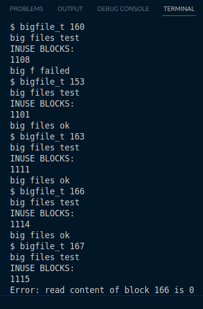
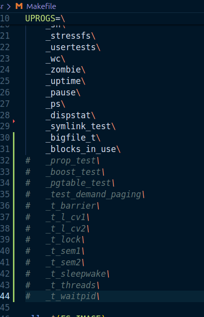
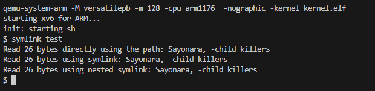

# Assignment 5

Authors:
- Aarsh Wankar
- Abhinav Khot
- Jaskirat Singh Maskeen
- Karan Sagar Gandhi

## Task 1: Modifying `bmap()` to support doubly indirect datablocks.

This allows us ot increase the maximum file size.

Initially we had 12 direct and 1 indirect, in that indirect block we had entries for 128 datablocks. Hence we were able to allocate a maximum of $12 + 128 = 140$ datablocks. With the last block as doubly indirect, we can support a max file size of: $11 + 128 + 128^2 = 16523$ datablocks. Each datablock is 512 bytes in size.

Now to test that our doubly indirect implemention works, we will create a bigfile with more than 140 blocks. That is the `bigfile_t <num_blocks>` test.

### Implementation:
We change `NDIRECT` to 11, and accordingly fix the size of `addrs` in `inode` structs. To implement doubly indirect logic, we change two functions in `fs.c`, `bmap()` and `itrunc()`.

#### Modifying `bmap()`
Hence, 
- `ip->addrs[0]` to `ip->addrs[10]` (11 blocks) are **Direct** blocks.
- `ip->addrs[11]` (`NDIRECT`) is the **Singly-Indirect** block.
- `ip->addrs[12]` (`NDIRECT+1`) is the **Doubly-Indirect** block.

The logic for direct, and singly indirect was not touched. We simply add a new if condition for `if (bn < (NINDIRECT * NINDIRECT))`, this checks if the given block number is in the range of having to go through a doubly indirect block, then we perform a two level lookup as follows:

- Level 1 Lookup:
    1. Access the doubly indirect block using `ip->addrs[NDIRECT+1]`.
    2. Calculate `indx = bn / NINDIRECT` to find the entry within this Level 1 block.
    3. This entry, `a[indx]`, points to a Level 2 block (which is just a singly-indirect block).
- Level 2 Lookup (same as singly indirect block logic):
    1. Read the Level 2 block found in the previous step.
    2. Calculate an index to find entry within this block `l2_idx = bn % NINDIRECT`.
    3. `a_2[l2_idx]` is the address of the datablock.

At any of these stages, if Level 1 block or Level 2 block doesn't exist then we allocate it using `balloc`, and save its address in its parent block (sort of).

#### Modifying `itrunc()`

This frees up the data, so it is undoing whatever `bmap` does.

For Direct and Singly-Indirect, we keep the logic as it is. They free all the 11 direct blocks and all the 128 blocks from the singly-indirect block.

Here also we add a new `if(ip->addrs[NDIRECT+1])` block is and do the following:

1. Read the Level 1 block `ip->addrs[NDIRECT+1]`.
2. For every entry in this block (total 128 entries):
    1. If the entry is an valid entry `if(a[i])`, then it is a Level 2 block.
    2. Read the Level 2 block.
    3. For every entry in the Level 2 block, free the data `bfree(ip->dev, a_2[j])`.
    4. Free the Level 2 block `bfree(ip->dev, a[i])`.
3. Free the Level 1 block `bfree(ip->dev, ip->addrs[NDIRECT+1])`.

### Issues:

1. **Limited Filesystem Space**:
The `mkfs.c` tool configures the filesystem with 1024 total blocks. These blocks are partitioned as follows:

    - Log Blocks (`nlog`): 10 blocks
    - Metadata Blocks (`usedblocks`): 29 blocks (for the boot sector, superblock, inode table, and block bitmap)
    - Data Blocks (`nblocks`): 985 blocks

The `fs.img` is built including all the user programs (`UPROGS`) from previous assignments. These tests (e.g., `_prop_test`, `_t_threads`, etc.) consume a large portion of the 985 available data blocks.

Hence we have very little freespace for any sort of file.

We can calculate the exact number of free blocks:

- Total Allocatable Blocks: size - nlog = 1024 - 10 = 1014 blocks
- Used Blocks (Metadata + Test Files): 945 blocks
- Free Blocks: 1014 - 945 = 69 blocks

Hence running `bigfile_t` with 68 blocks will pass however, with 69 will fail.

### Solutions:

#### First solution (Expand the filesystem):

We edit the `mkfs.c` file, and set `nblocks` to 985+100, and set `size` to 1024 + 100.

Now we can allocate upto `166` blocks to a file.

#### Second solution (Disable old tests):

We comment out all previous test programs from the `UPROGS` list.

Running our `bigfile_t`:

With this change, the `bigfile_t` can now easily write 400+ blocks, proving our `bmap` implementation works for large files.

## Task 2: Adding symbolic links to xv6
Symbolic links (or symlinks / soft links) refer to a linked file or directory by pathname; when a symbolic link is opened, the kernel looks up the linked-to name. Symbolic links resemble hard links, but hard links are restricted to pointing to files on the same disk, cannot refer to directories, and are tied to a specific target i-node rather than (as with symbolic links) referring to whatever happens at the moment to be at the target name, if anything.

### Implementation:
We implement the `symlink(char *target, char *path)` system call, which creates a new symbolic link at `path` that refers to file named by `target`.

The main steps are:
1. **Define a new file type for symlinks**:
   In `stat.h`, we define a new file type `T_SYMLINK` to represent symbolic links. This way, we can differentiate symlinks from regular files and directories. Note that files, directories, and symlinks all share the same inode structure. Each inode contains pointers to data blocks, which store the actual content of the file, directory entries, or symlink target path.
2. **Implement the `symlink` system call**:
    In `sysfile.c`, we implement the `sys_symlink` function. This function takes two arguments: the target path and the symlink path. It performs the following steps:
    - Validates the input paths.
    - Allocates a new inode for the symlink using `ialloc()`.
    - Sets the inode type to `T_SYMLINK`.
    - Writes the target path into the data block(s) of the symlink inode.
    - Creates a directory entry for the symlink in the parent directory of `path`.
3. **Modify the `open` system call to handle symlinks**:
    In `sysfile.c`, we modify the `sys_open` function to check if the file being opened is a symlink. If it is, we read the target path from the symlink's data block with a while loop to handle nested symlinks. We then attempt to open the target file instead.
### Testing:
We create a new user program `symlink_test.c` to test our symlink implementation. This program performs the following steps:

1. Creates a regular file and writes some data to it.
2. Creates a symlink to the regular file using the `symlink` system call.
3. Opens the symlink and reads the data, verifying that it matches the original file's content.
4. Tests nested symlinks by creating a symlink to another symlink and verifying that it resolves correctly.

Here is the output of the `symlink_test` program:

This output shows that the symlink was created successfully, and the data read through the symlink matches the original file's content. The nested symlink also resolves correctly, demonstrating that our implementation works as intended.

In the end we added a final test file which tests creating both a symlink and a bigfile. This is `bigfile_symlink_t.c` which creates a bigfile using doubly indirect blocks and then creates a symlink to it and reads back the data to verify correctness.