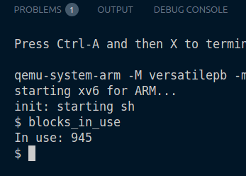
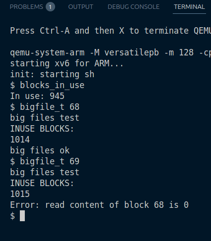
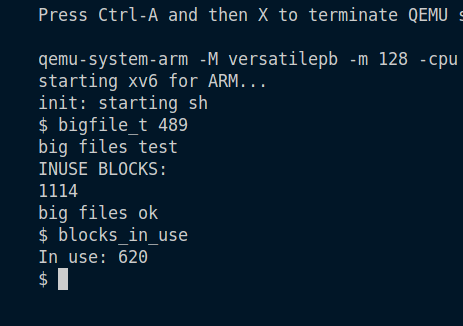

### task 1

Note: since we are adding featuers to our previous repository, we have created many tests, so they take up the on disk inode blocks. hence for the big file write (it fails at 145 blocks.)

inuse_blocks with all tests included:

Now since our fs has 1024 blocks, 985 are for data, 10 are for log, and 29 reserved blocks as unused, super, inodes etc.
check:
985+10+29 = 1024

Now, since we have already used 945 blocks, available datablocs (1024-10) - 945 = 69.

Hence running bigfiletest with 68 blocks will pass however, with 69 will fail.

Hence we will increase the number of the blocks from 1024 to 1124.
[We could have also disabled tests for the previous assignments, but what is the fun in that :)]

We need to ensure : `assert(nblocks + usedblocks + nlog == size)` [In mkfs.c]

Hence we increase both the `size` and `nblocks` by 100.

Now we can allocate upto `166` blocks to a file.

Lastly, we show how we can disable all other tests, and allocate even more !

Running our bigfiletest:

