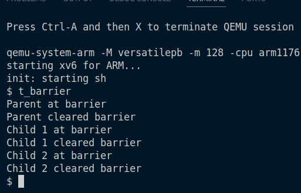
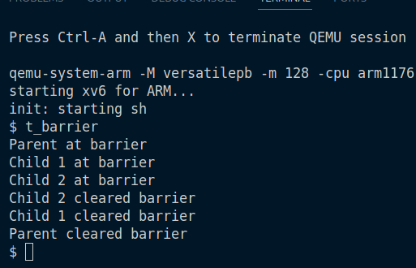

## Task 1: Barriers as synchronization primitives (4 pts.)

Our goal is to keep processes waiting till `N` processes arrive at some barrier, and then all should be woken up.

For this we keep a counter, `barrier_counter`. Now when a new process arrives, if the counter is less than `N`, then this process should sleep (on channel,`barrier_counter`). When the `N`-th process arrives, we wake up all the processes sleeping on the channel `barrier_counter`.

Since multiple processes can arrive at the same time, to prevent race conditions we use a `spinlock` on the counter.

### Without barrier `t_barrier`

### With barrier `t_barrier`

## Task 2: Threads (8 pts.)

## Task 3. Userspace locks and condition variables (6 pts.)

## Task 4. Semaphores in xv6 (4 pts.)

