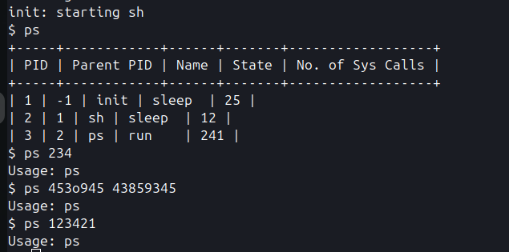

We implement the ps command to work entirely in the user space. To aid this we implement the following syscalls:
- int get_nsyscall(int pid) : Returns the number of syscalls made by the process.
- int get_proclist(int* buffer): The kernel writes to the buffer in the user space passed by the user with the active processes. Writes -1 in the spot of an unused process.
- int get_parproc(int pid): Returns the PID of the parent process.
- int get_procstate(int pid): Returns the current state of the processs.(eg. running, sleep, zombie etc)
- int get_procname(int pid, char* buffer): Writes the name of the process with the given ID in the buffer in user space passed as an arg.

The command itself is implemented in `usr/ps.c`

The working is shown below:

PS: the absurd number of syscalls made by ps is due to how printf() is implemented in the OS. Each charecter printed takes one sys call :0
